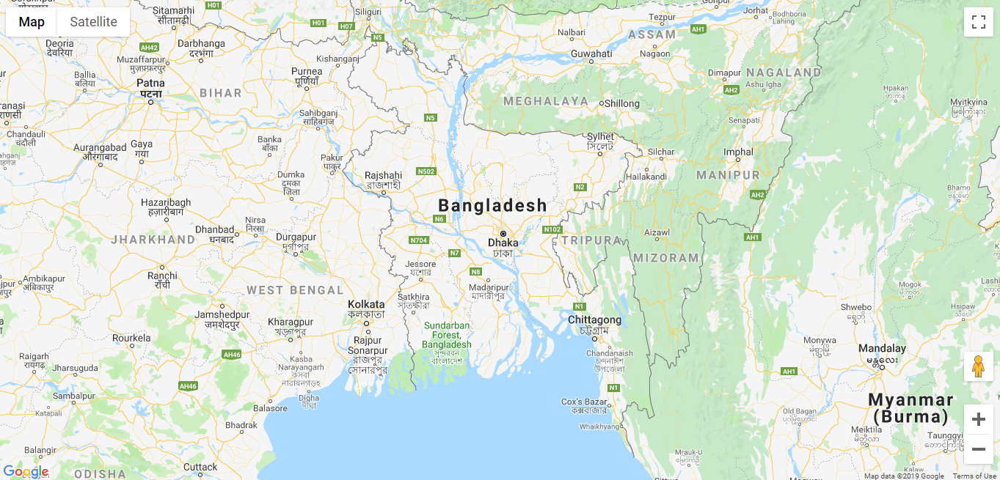
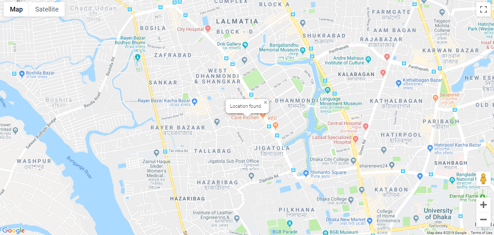

# Simple Google Geolocation Map
Simple google geolocation maps api with infowindow, Features included:
- Maps with marker
- Find your location
- Info Window in location

## Required Changes

```
Set latitude and longitude for desired location
```

```
Set your google api key in "APP KEY"
```

```
Change infowindow content as you want to show in infowindow
```

### Demo Images


```
Allow google to detect your location
```


